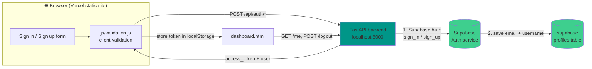

## 🧭 How it works (flowchart)



**1 signup / 1 login flow:**

```
User  →  Form  →  POST /api/auth/signup|login  →  FastAPI  →  Supabase Auth
                                          ↑                                      │
                                          └────────────────── verify/save ────────┘
                                     return access_token → frontend saves it
                                     → redirect to dashboard.html
```

---

## 🔌 API Endpoints

| Method | Path | Description |
|---|---|---|
| POST | `/api/auth/signup` | Create account (email + password + username) → saves to `profiles` |
| POST | `/api/auth/login` | Verify email + password → returns `access_token` |
| POST | `/api/auth/forgot-password` | Send reset link (never reveals which emails exist) |
| POST | `/api/auth/reset-password` | Set new password with the reset token |
| GET | `/api/auth/me` | Current user (email + username) |
| POST | `/api/auth/logout` | Invalidate session |
| GET | `/health` | Backend ↔ Supabase connection check |

Credentials: `SUPABASE_URL`, `SUPABASE_ANON_KEY` (Supabase Dashboard → Settings → API).
Frontend↔backend URL: `js/config.js` → `API_BASE_URL` (default `http://localhost:8000`).

---

